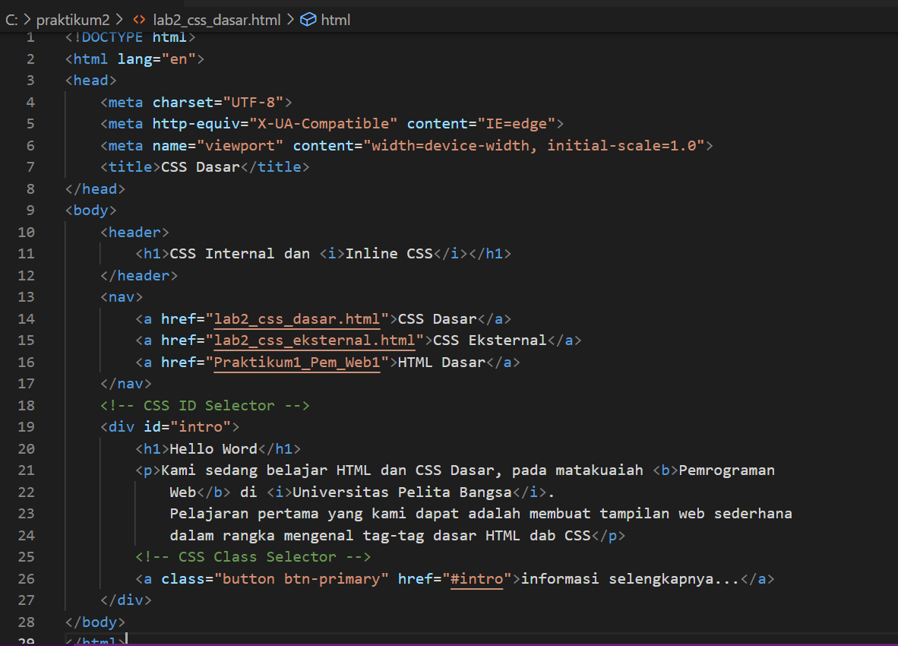
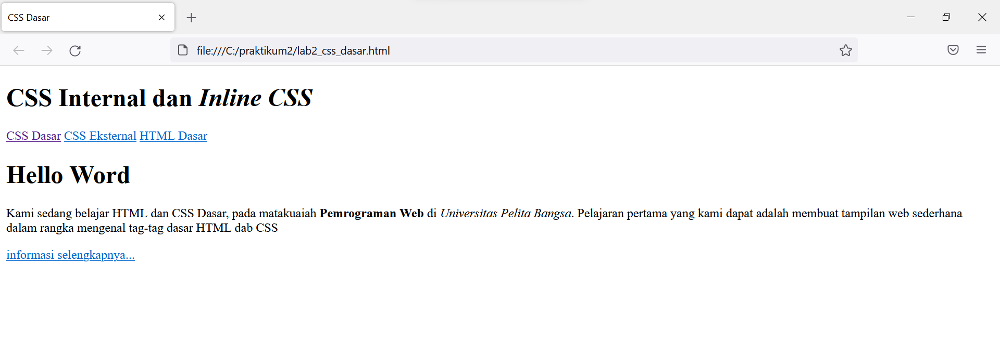
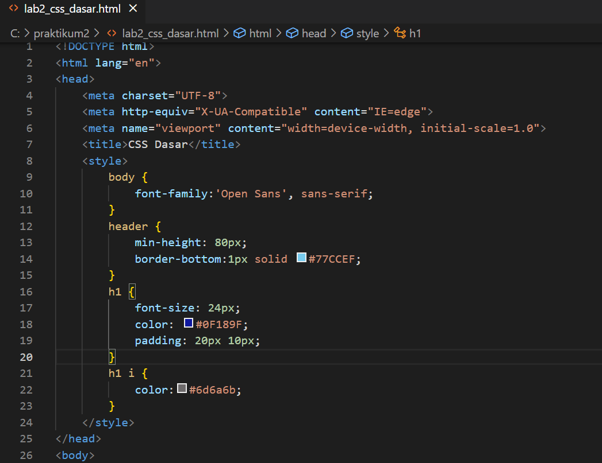
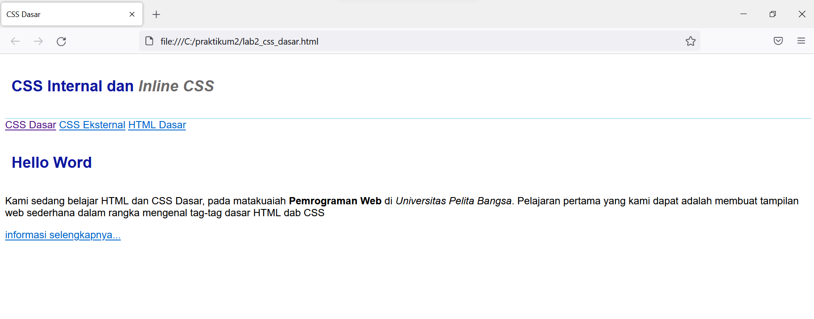
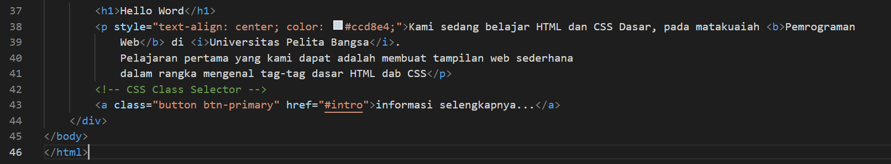
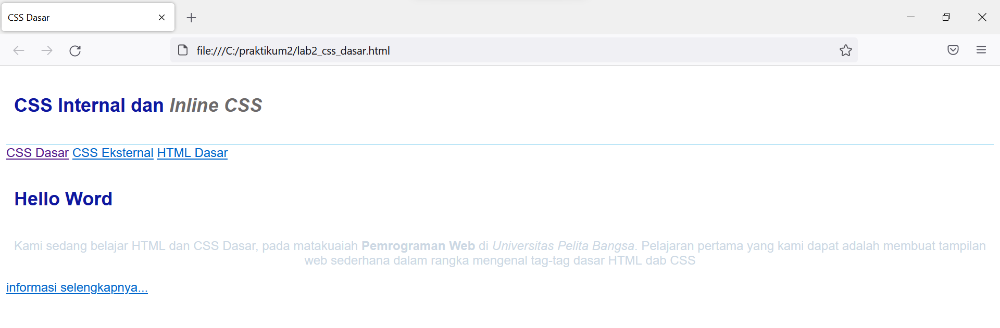
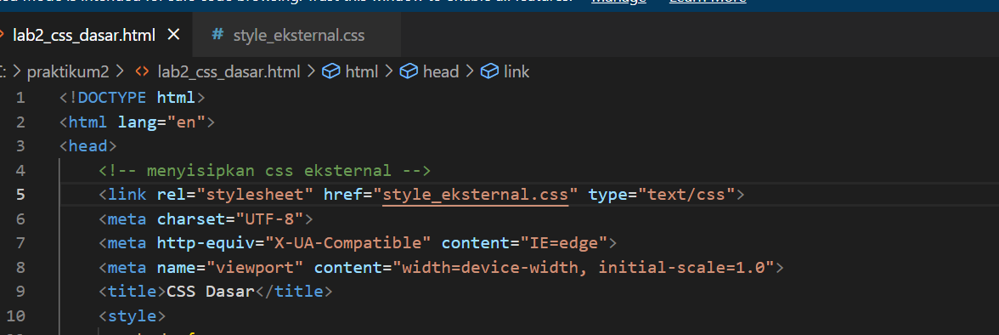
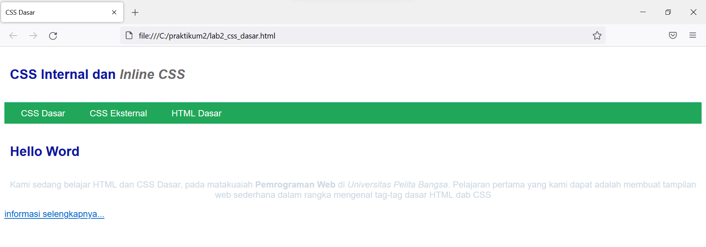
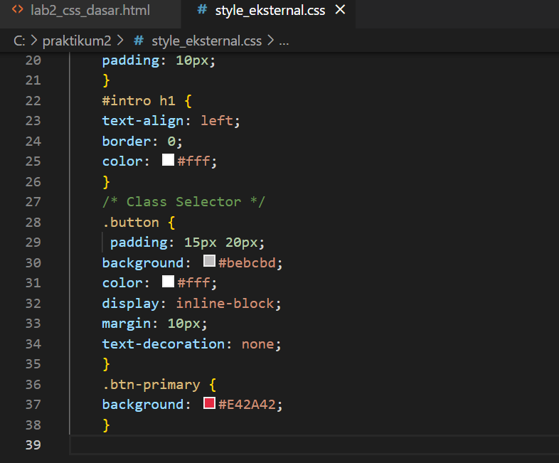
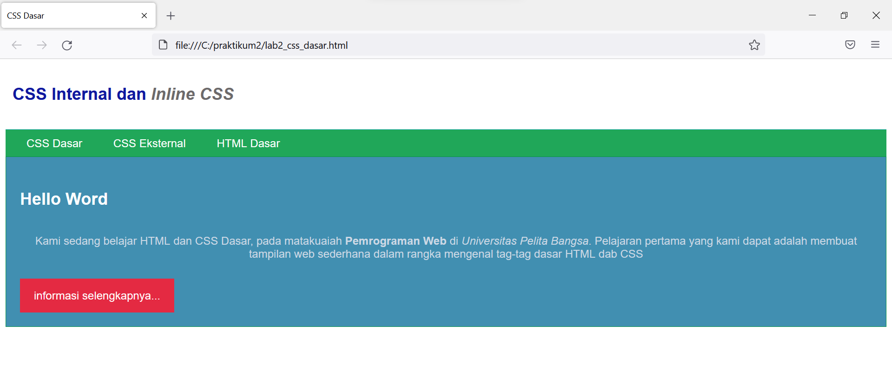

# Lab2Web

## Belajar CSS Dasar
## 1. Membuat Documen HTML
Buatlah documen HTML seperti pada gambar di bawah ini

Setelah itu disimpan kemudian buka pada browser fire fox untuk melihat hasilnya
Perhatikan gambar dibawah. Tampilan documen HTML

## 2. Mendeklarasikan CSS Internal
Kemudian tambahkan deklarasi CSS internal seperti berikut pada bagian head dokumen.
Tampilan programnya

Selanjutnya simpan perubahan yang ada, dan lakukan refresh pada browser untuk melihat 
hasilnya.
Tampilan penambahan CSS pada HTML

## 3. Menambahkan Inline CSS
Kemudian tambahkan deklarasi inline CSS pada tag "
" seperti berikut

Simpan kembali dan refresh kembali browser untuk melihat perubahannya.
Tampilan setelah penambahan inline CSS

## 4. Membuat CSS Eksternal
Buatlah file baru dengan nama "style_eksternal.css" kemudian buatlah deklarasi CSS seperti berikut.
Tampilan kode tag pada programnya

Kemudian tambahkan tag "<link>" untuk merujuk file css yang sudah dibuat pada bagian "<head>". Setelah itu refresh browser dann lihat perubahannya. 
Tampilan Eksternal CSS

## 5. Menambahkan CSS Selector
Selanjutnya menambahkan CSS Selector menggunakan ID dan Class Selector. Pada file 
"style_eksternal.css", tambahkan kode berikut.

Kemudian simpan kembali dan refresh browser untuk melihat perubahannya.
Tampilan browser setelah menambahkan CSS Selector

Latihan CSS Dasar pada HTML. Teknik Informatika, UNIVERSITAS PELITA BANGSA
